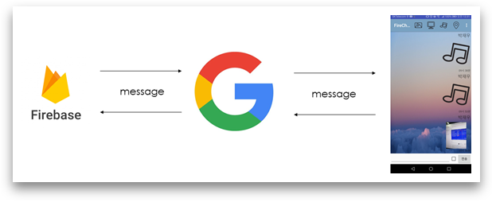
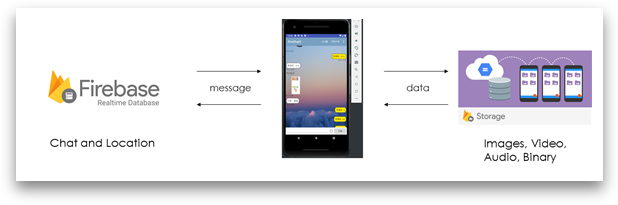

# FireChat2
Firebase를 이용한 채팅앱을 만들어주었습니다.

백엔드 서버 없이 만들었습니다.

### 통신 개요입니다.

### 다이어그램입니다.

최대한 카카오톡을 모방해서 만들었기에,
기본적인 UI는 카카오톡과 비슷합니다.

다만 다른 점은, 저희 채팅앱은 위치 추적이 됩니다.

2초마다 위치를 업데이트해서,
멤버들의 위치를 실시간으로 알 수 있습니다.
